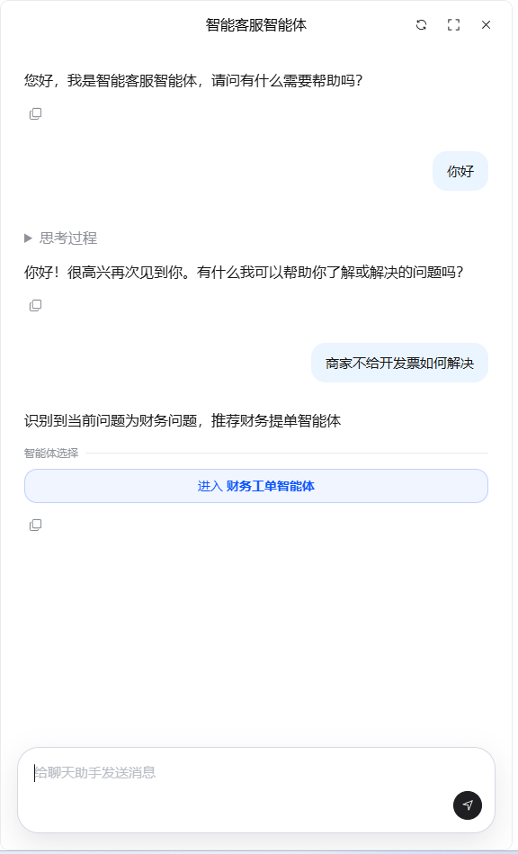
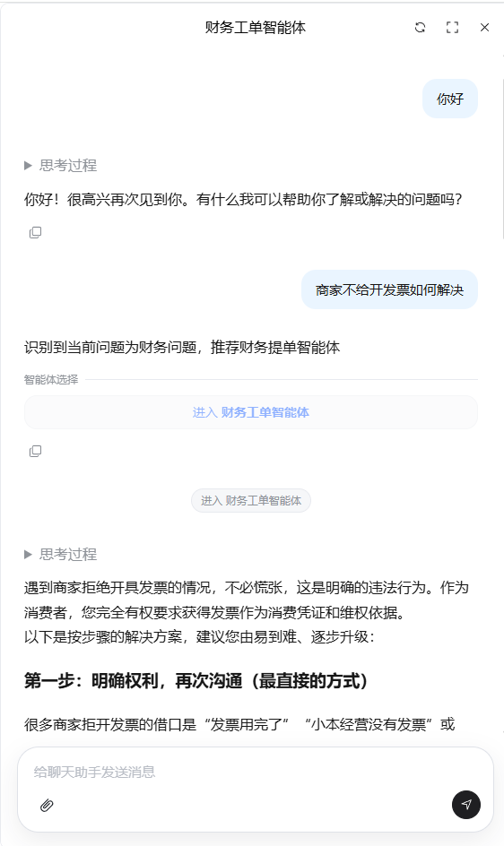
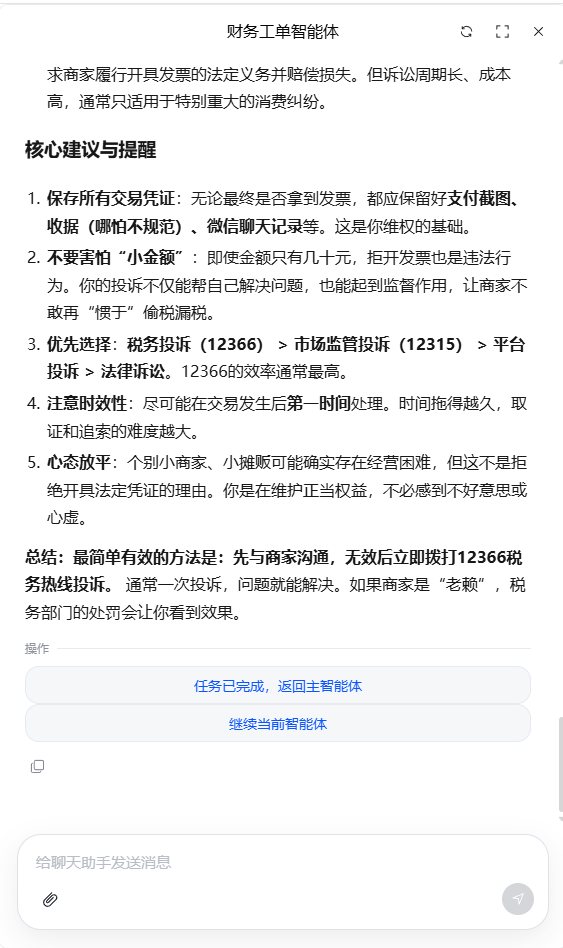
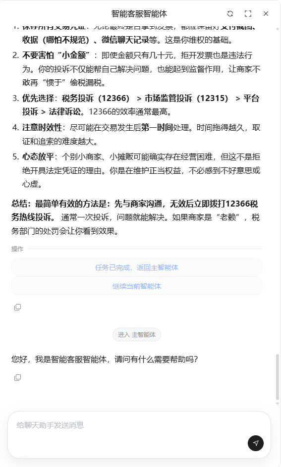

# ChatBridge · 嵌入式 AI 对话窗口

把 AI 客服、多智能体协作和文件问答能力，以一个轻量 iframe 快速桥接进现有业务系统。

适合需要快速上线 AI 助手的门户、业务中台、SaaS 后台、客户服务入口和内部工作台。接入方不需要重做页面结构，也不需要从零实现聊天交互，只要嵌入窗口、传入来源和用户标识，就能把不同系统连接到对应的 AI 服务。

## 亮点1：后台 AI 能力：基于 Dify 快速构建

ChatBridge 不包含任何 AI 模型，所有智能能力由后端 Dify 平台提供。Dify 支持可视化编排工作流、接入知识库（RAG）、配置工具调用，几分钟即可上线一个 AI 助手，无需从零搭建 AI 后端。每个 Dify 应用对应一个 `api-key`，ChatBridge 通过 `ORIGIN_CHAT_CONFIG` 将不同业务来源映射到不同应用，实现一套前端、多套 AI 后端。

详细说明：[后台 AI 能力与 Dify 集成](docs/guides/dify-integration.md)

## 亮点2：多智能体架构：Chatflow 解耦方案

Dify 的 Chatflow 是单体流程，无法跨应用调用，长流程和多分支场景下画布会迅速膨胀。ChatBridge 参照 Google A2A 协议提出前端路由解耦方案：每个 Chatflow 只负责单一职责，由前端感知输出信号、完成智能体切换，并通过 `input` 字段将上游结论传递给下游，实现跨 Chatflow 的上下文延续，无需任何后端服务间调用。

详细说明：[多智能体架构与 Chatflow 解耦方案](docs/guides/multi-agent-architecture.md)

## 为什么使用它

- **上线更快**：用 iframe 嵌入，不侵入原有系统，适合渐进式接入 AI 能力。
- **体验完整**：支持流式回复、文件上传、暂停生成、Markdown 和公式展示，让 AI 对话更接近真实业务使用场景。
- **一个入口，多种助手**：同一个聊天窗口可以根据业务来源进入不同主智能体，也可以在对话中跳转到专项智能体。
- **更容易集成**：窗口和父页面通过消息通信，可控制全屏、关闭和刷新，便于放进已有产品流程。
- **面向长期运营**：前端只负责轻量交互和嵌入，AI 编排、知识库和工具能力交给后端智能体平台持续迭代。

## 适用场景

- 在业务系统右下角接入 AI 客服或智能问答。
- 为不同客户、部门或产品线配置不同的 AI 助手入口。
- 在一个主助手中引导用户进入合同、数据、售后、培训等专项智能体。
- 在内部系统中提供文件解读、流程咨询、知识库问答和任务办理入口。

## 效果预览

| 对话窗口 | 多智能体跳转 |
|:---:|:---:|
|  |  |
| **任务完成** | **跳转回主智能体** |
|  |  |

## 产品能力

- **即插即用的聊天入口**：以固定窗口或全屏模式嵌入任意页面。
- **多智能体流转**：AI 回复可生成“进入智能体”按钮，把用户带到更专业的处理流程。
- **文件辅助对话**：根据后端能力自动展示上传入口，支持按配置限制文件类型和数量。
- **富文本答案展示**：支持 Markdown、代码块、表格、引用和数学公式。
- **会话刷新与回到主助手**：父页面或用户操作都可以重置会话，回到默认智能体。
- **父页面联动**：聊天窗口可通知父页面切换全屏或关闭入口。

## 快速体验

```bash
pnpm install
pnpm run dev
```

开发服务默认启动在：

```text
http://localhost:5173
```

打开聊天窗口：

```text
http://localhost:5173/embedChatView?origin=your-system&userID=your-user-id
```

构建生产包：

```bash
pnpm run build
```

## 嵌入到你的产品

在业务系统页面中放入 iframe：

```html
<iframe
  src="https://your-chat-domain.example.com/embedChatView?origin=your-system&userID=your-user-id"
  title="AI 对话"
  allow="clipboard-write; fullscreen"
></iframe>
```

参数说明：

- `origin`：业务来源标识，用于匹配不同系统的 AI 助手配置。
- `userID`：业务系统中的用户标识，用于保持对话用户上下文。

项目也提供了一个完整嵌入示例：

```text
public/embed-chat-iframe.html
```

## 为不同系统配置不同助手

在 `src/config.js` 中维护来源和智能体配置：

```js
export const ORIGIN_CHAT_CONFIG = {
  'your-system': {
    HGAI_BASE_URL: 'https://your-dify-domain.example.com',
    MAIN_AGENT_API_KEY: 'app-xxxxxxxxxxxxxxxx',
  },
};
```

没有匹配到 `origin` 时，会使用默认配置。

> **安全提示**：`api-key` 写在前端配置中，会随页面资源下发到浏览器，任何人都可以通过查看源码或开发者工具读取。建议在 Dify 中为每个应用设置速率限制和用量上限，避免 key 被滥用；生产环境可考虑通过后端中转代理来隐藏真实 api-key，不直接暴露在前端。

## 父页面联动

聊天窗口会向父页面发送以下消息：

```js
{ type: 'toggleFullScreen', isFullScreen: true }
{ type: 'closeChat' }
```

父页面也可以主动刷新聊天窗口：

```js
const iframe = document.querySelector('iframe');

iframe.contentWindow.postMessage({ type: 'refreshChat' }, '*');
```

用途：

- 用户点击全屏按钮时，父页面把 iframe 容器扩展到整屏。
- 用户点击关闭按钮时，父页面隐藏聊天入口。
- 业务流程完成后，父页面通知聊天窗口开启一轮新会话。

## 部署建议

- 生产环境部署 `dist/` 目录。
- 服务器需要把前端路由回退到 `index.html`，保证直接访问 `/embedChatView` 不会 404。
- 如果 AI 服务和聊天页面不在同一域名，需要确保后端接口允许跨域访问。
- 提交或部署前建议运行一次：

```bash
pnpm run build
```

## 技术底座

项目采用 Vue 3 和 Vite 构建，保持轻量、易嵌入、易部署。

依赖要求：

- Node.js 18+
- pnpm

## 参与贡献

欢迎任何形式的贡献，包括但不限于代码提交、Bug 反馈、文档改进和功能建议。

- 提交 PR 前先跑通 `pnpm run build`，确保构建通过。
- 遵循项目现有的代码风格和文件结构。
- 不要把生产环境的 API Key 写入 PR、截图或示例代码中。
- 较大的功能改动建议先提 Issue 讨论方案，避免做无用功。

## 开源协议

本项目基于 [MIT License](LICENSE) 开源。

## 致谢

感谢 [Dify](https://github.com/langgenius/dify) 提供的开源 LLM 应用开发平台，ChatBridge 的 AI 后端能力均建立在 Dify 之上。
